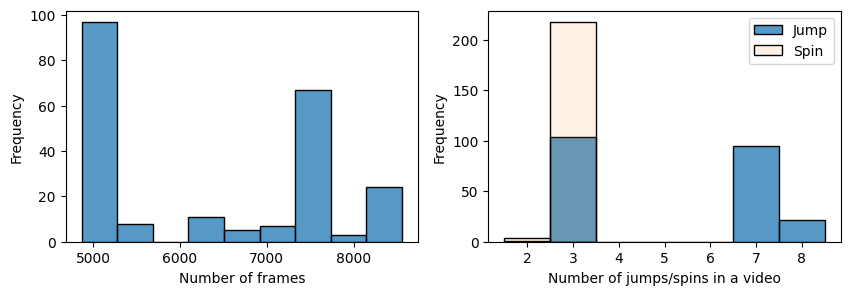
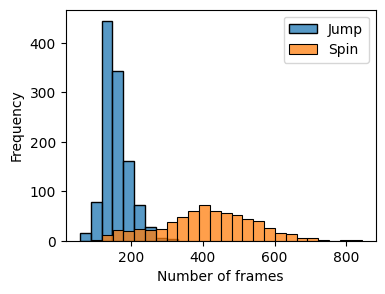
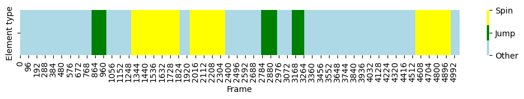
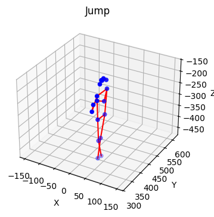
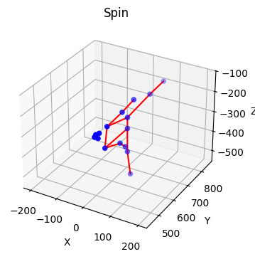
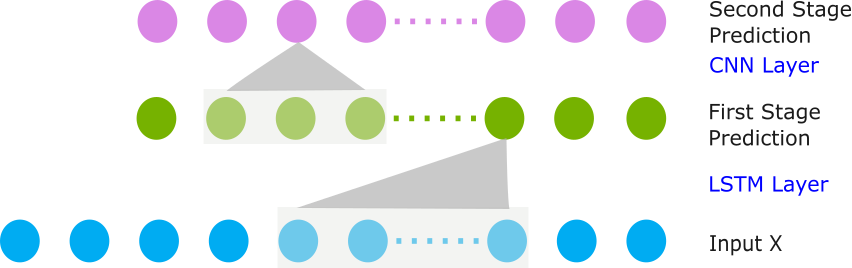
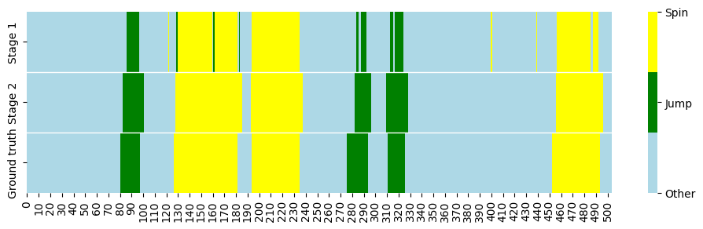

# Action Segmentation of Figure Skating Competition Videos: A Skeleton-Based Approach

## Quick Start
- This project implements a two-stage LSTM-CNN framework for action segmentation of figure skating competition videos using skeleton data.
- The LSTM stage applies a sliding-window approach to provide frame-wise predictions, and the CNN stage refines these predictions by capturing temporal dependencies between frame labels.
- The model is evaluated with 5-fold cross-validation using both frame-wise accuracy and segmental F1@50, showing significant improvements over an LSTM model alone.
```
# 1. Create environment and install dependencies
python -m venv .env
source .env/bin/activate # (macOS/Linux)
pip install -r requirements.txt

# 2. Run the pipeline (including training, evaluation, etc)
cd scripts
sbatch run_pipeline.sh

# 3. Run generate_plots.ipynb to generate the plots
```

## Introduction
Figure skating is a sport in which skaters execute pre-planned technical elements (e.g., jumps, spins) within a choreographed routine set to music. In figure skating judging, judges often need to replay a technical element to determine its difficulty and execution. Under the current system, a replay operator is responsible for marking the start and end time of each element as it's being performed, allowing for quick access to replays during the review process. In this project, I aim to automate this process via action segmentation using a deep learning framework.

Instead of raw video frames, I work with the skeleton joints of the athlete extracted from video frames, which capture the athlete's posture while filtering out irrelevant visual details such as the background colour or audience movement. The model assigns a label to each frame (e.g., jump or spin) and outputs the start and end timestamps of each segment/element. As skeleton extraction methods are already well established, this project leverages existing skeleton-based figure skating video datasets and focuses on building the action segmentation model.

## Data and Summary Statistics
The datasets used in this project are [MCFS](https://shenglanliu.github.io/mcfs-dataset/) and [MMFS](https://github.com/dingyn-Reno/MMFS/tree/main). These two datasets were developed by the same team and both used videos from the 2017-2019 World Figure Skating Championships.

MCFS contains 271 videos of single-skater competition routines. Each video is 162–285 s long (≈2.7–4.75 minutes) and recorded at 30 fps. Pose skeletons were extracted with OpenPose (BODY_25). The dataset provides per-frame (frame-wise) annotations, which are essential for supervised training in action segmentation. However, the pose quality is imperfect: 56% of frames have at least one missing joint, and 19% of frames have at least three missing joints.

MMFS consists of 1176 videos of single-skater competition routines, of which 222 routines share the same video source as MCFS. In MMFS, skeletons are extracted in the COCO 17-keypoint format. Unlike MCFS, MMFS does not suffer from missing data issues. However, it only provides routine-level annotations of elements performed, without frame-wise labels.

In order to use the best available data, I focus on the 222 shared routines between MCFS and MMFS. Specifically, I use the pose keypoints from MMFS as features and the per-frame annotations from MCFS as labels. This pairing allows me to combine high-quality skeleton features with detailed frame-level labels.

### Descriptive Statistics
Each single-skater competition consists of two segments: the short program (SP) and the free skate/long program (LP). The duration of an SP is set at 2 minutes and 40 seconds (±10 seconds), while an LP lasts 4 minutes or 4 minutes and 30 seconds (±10 seconds), depending on the discipline (women’s or men’s) and the season. Since the data source includes both SP and LP, we observe a bimodal distribution of video frame lengths (Figure 1a). Consistent with figure skating rules, most videos contain 3 jumps (for SP) or 7–8 jumps (for LP), as well as 3 spins (Figure 1b).

<p align="center">
  
  <br>
  <em>Figure 1: Video Frame Lengths and Element Count</em>
</p>
Figure 2 shows the distribution of jump and spin durations in frames. On average, a jump takes 158 frames (≈5 seconds), which is shorter than a spin (414 frames, ≈14 seconds). Note that the actual airtime of a jump or the rotation time of a spin is shorter, since the ground-truth labels for both include the entry and exit transitions.
<p align="center">
  
  <br>
  <em>Figure 2: Element Duration</em>
</p>

Figure 3 shows the element distribution for a particular SP video, and Figure 4 presents skeleton examples of a jump and a spin from the same video.

<p align="center">
  
  <br>
  <em>Figure 3: Element Distribution Example</em>
</p>

<p align="center">
  
  
  <br>
  <em>Figure 4: Skeleton Examples</em>
</p>

To reduce computational cost and running time, I downsample the videos by taking every 10th frame, resulting in an effective frame rate of 3 fps. This frequency is sufficient given the nature of the task: the first and last ~10 frames of an element are generally entry and exit transitions, and the exact start and end times of an element are ambiguous anyway.

Additionally, to remove variation in scale and global position across frames, I normalize the skeletons to a consistent size and center them so that their center of mass is at the origin (0, 0, 0), which is a standard practice in the literature.

## The Model and Experiments
### The Model
I use a two-stage LSTM-CNN framework for action segmentation. In the LSTM layer, I use a sliding window approach to generate frame-wise predictions. More specifically, the input of the model is a sequence of frames with a fixed length. The LSTM layer processes the sequence step by step, capturing temporal dependencies of movement, and the last hidden state of the LSTM layer is then passed to a dense layer that predicts the last frame's label. The issue with an LSTM layer alone is that each frame's prediction is independent, and the model does not account for the fact that neighbouring frames are likely to share the same label, which leads to an over-segmentation problem.

To tackle this issue, I feed the frame-wise predictions from the LSTM layer into a 1D-CNN model. The CNN layer captures temporal dependencies between frame labels and refines the predictions from the LSTM stage. Figure 5 provides a visual overview of the model.

<p align="center">
  
  <br>
  <em>Figure 5: Visual Overview of The Model</em>
</p>

### Experiments
I use 5-fold cross-validation to evaluate the performance of the LSTM model alone (only the first stage) and the two-stage LSTM-CNN framework. The LSTM layer contains 64 units and operates on input sequences of length 20. The CNN stage first takes the first-stage predictions and embeds them into a 32-dimensional space, and then applies two 1D convolutional layers (64 filters, kernel size = 10, ReLU), each followed by a dropout layer (p = 0.3). To handle variable video lengths, sequences are padded; padded positions are excluded from loss/metrics via masking. Both stages are trained for 10 epochs with Adam (learning rate = 0.001) and batch size = 32.

**Evaluation Metrics** I use frame-wise accuracy as a baseline metric. However, frame-wise metrics can be misleading for action segmentation tasks because they ignore segment boundaries and temporal consistency; a model may achieve high frame-wise accuracy while still suffering from severe over-segmentation errors. To evaluate the segmentation quality, I also report F1@50, which is a segment-wise metric proposed by [[1]](#1). [[2]](#2) provides a very intuitive description of F1@50: a predicted action segment is first classified as a true positive (TP) or false positive (FP) by comparing its intersection over union (IoU) with respect to the corresponding expert annotation. If the IoU crosses 50%, it is classified as a true positive segment (TP); if it does not, as a false positive segment (FP). The number of false-negative segments (FN) in a video is calculated by subtracting the number of correctly predicted segments from the number of segments that the experts had demarcated. From the classified segments, the segmental F1-score for each video can be computed as
$F1@50 = \frac{TP}{TP + \frac{1}{2}(FN+FP)}$. This metric penalizes over-segmentation errors while allowing for small temporal shifts between the predictions and ground truth. This is appropriate for our setting, where the exact start and end times of an element are inherently ambiguous.

Table 1 displays the average frame-wise accuracy and segment-wise F1@50 on the test splits across five cross-validation folds, for both the first-stage and the final predictions. Figure 7 plots the model predictions for one example video. We can see that the first-stage prediction achieves a decent accuracy score (0.88), but it has a low F1@50 (0.31) due to over-segmentation errors. The CNN stage successfully mitigates over-segmentation by incorporating local temporal dependencies in the label sequence, achieving 0.92 frame-wise accuracy and 0.89 F1@50. A demo video with per-frame ground truth and model predictions is available at [this](https://youtube.com/shorts/qOXkx_gUVEE?feature=share) YouTube link.

*Table 1: Model Performance*
| Model | Accuracy | F1@50 |
| :------- | :------: | -------: |
| LSTM | 0.88 | 0.31 |
| LSTM-CNN | 0.92 | 0.89 |


<p align="center">
  
  <br>
  <em>Figure 7: Model Predictions - An Example</em>
</p>

## Future Work
The current model outputs the start and end times of elements as well as their broad types (jump or spin). This is sufficient to automate the replay operator’s work, since the model can return the correct segment based on element order. However, the exact element name (e.g., sit spin, layback spin) still needs to be identified by a technical specialist, as is currently the case. Future work could extend this framework by further applying an action detection model that predicts each segment’s exact element name, thereby automating the technical specialist’s work as well.

## References
<a id="1">[1]</a> 
Lea, C., Flynn, M. D., Vidal, R., Reiter, A., & Hager, G. D. (2017). Temporal convolutional networks for action segmentation and detection. In proceedings of the IEEE Conference on Computer Vision and Pattern Recognition (pp. 156-165).

<a id="2">[2]</a> 
Filtjens, B., Vanrumste, B., & Slaets, P. (2022). Skeleton-based action segmentation with multi-stage spatial-temporal graph convolutional neural networks. IEEE Transactions on Emerging Topics in Computing, 12(1), 202-212.
