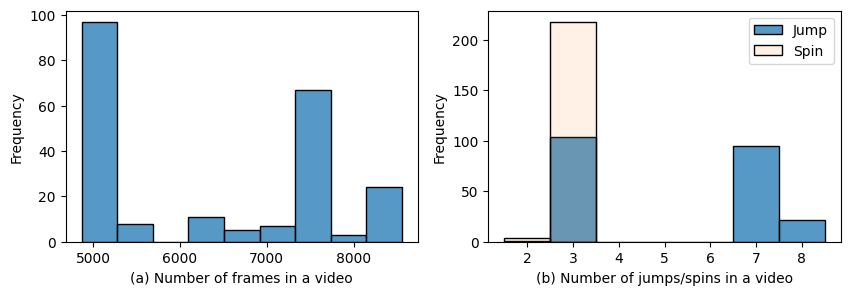
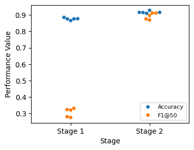

# Action Segmentation for Figure Skating Competition Videos: A Skeleton-based Approach

## Introduction
Figure skating is a sport in which skaters execute pre-planned technical elements (e.g., jumps, spins) within a choreographed routine set to music. In figure skating judging, judges often need to replay a technical element to determine its difficulty and execution. Under the current system, a replay operator is responsible for marking the start and end time of each element as it's being performed, allowing for quick access to replays during the review process. In this project, I aim to automate this process via action segmentation using a deep learning approach.

In a complete pipeline, we need to first extract the skeleton joints from each video frame, capturing the athlete's posture while ignoring irrelevant information such as the background colour and the audience's movement. Then the model assigns each frame a label (e.g., a jump or a spin) and outputs the start and end timestamps for each segment/element. There are already well-established methods available for skeleton extraction. As a result, this project uses the existing skeleton-based figure skating video datasets and focuses on building the action segmentation model.

## Data and Summary Statistics
The datasets used in this project are [MCFS](https://shenglanliu.github.io/mcfs-dataset/) and [MMFS](https://github.com/dingyn-Reno/MMFS/tree/main). These two datasets were developed by the same team and both used videos from the 2017-2019 World Figure Skating Championships.

MCFS contains 271 videos of single-skater competition routines. Each video is 162–285 s long (≈2.7–4.75 min) and recorded at 30 fps. They extracted pose skeletons with OpenPose (BODY_25). The dataset provides per-frame (frame-wise) annotations, which are essential for supervised training for action segmentation. However, the pose quality is imperfect: X% of frames have at least one missing joint, and Y% of frames have at least X missing joints.

MMFS consists of 1176 videos of single-skater competition routines, among which 222 routines share the same video source as MCFS. Like MCFS, each video is recorded at 30 fps. In MMFS, skeletons are extracted in the COCO 17-keypoint format. It has a better data quality than MCFS: only X\% of frames have missing joints, as opposed to Y% in MCFS. However, MMFS only records elements performed in each routine and does not contain per-frame annotations.

In order to use the best data source available, I use the 222 shared routines between MCFS and MMFS. More specifically, I use the pose keypoints from MMFS as features and the per-frame annotations from MCFS as labels.

### Descriptive Statistics
Each single-skater competition consists of two segments: the short program (SP) and the free skate/long program (LP). The duration of a SP is set at 2 mintues and 40 seconds (+/- 10 seconds), and a LP lasts 4 minutes or 4 minutes and a half (+/- 10 seconds), varying by the discipline (women or men) and season. Since the data source contains both SP and LP, we see a bi-modal distribution of video frame lengths (Figure 1a). Consistent with the figure skating rule, most videos contain 3 (for SP) or 7-8 (for LP) jumps and 3 spins (Figure 1b).

  
   
  <em>Figure 1: Video Frame Lengths and Element Count</em>

Figure 2 shows of the distribution of jump and spin durations in frames. A jump on average takes 158 frames (5 seconds), which is less time than spins (414 frames and 14 seconds). Note that the actual time needed for a jump or a spin is shorter, as ground-truth labels for jumps and spins include the entry and exit transitions (approach and landing). This is consistent with the judging practice - judges review entries and exits as well during the replay.

  
   
  <em>Figure 2: Element Duration</em>

Figure 3 plots the element distribution for a particular SP video. Figure 4 displays the skeleton examples of a jump and a spin from that video.

  
   
  <em>Figure 3: Element Distribution Exmple</em>

  
  
   
  <em>Figure 4: Skeleton Examples</em>

To remove variation in scale and global position across frames, I normalize the skeletons to a consistent size and center them so that their center of mass is at the origin (0, 0, 0), which is a standard practice in the literature.

## The Model and Experiments
### The Model
I use a two-stage LSTM-CNN framework for action segmentation. In the LSTM layer, I use a sliding window approach to generate frame-wise predictions. More specifically, the input of the model is a sequence of frames with a fixed length (20). The LSTM layer processes the sequence step by step, capturing temporal dependencies of movement, and the last hidden state of the LSTM layer is then passed to a dense layer that predicts the last frame's label. The issue of a LSTM layer alone is that each frame's prediction is independent, and the model does not account for the fact that neighboring frames are likely to share the same label, which leads to an over-segmentation problem.

To tackle this issue, I feed the frame-wise predictions from the LSTM layer to a 1d-CNN model. The CNN layer captures the temporal dependencies between frame labels and refines the predictions from the LSTM stage. Figure 5 provides a visual overview of the model.

  
   
  <em>Figure 5: Visual Overview of The Model</em>

### Experiments
I use 5-fold cross validation to evaluate the performances of the LSTM model alone (only the first stage) and the two-stage LSTM-CNN framework. The LSTM layer contains 64 units and operates on input sequences of length 20. The CNN stage first takes the first-stage predictions and embeds them into a 32-dimensional space, and then applies two 1D convolutional layers (64 filters, kernel size = 10, ReLU), each followed by a dropout layer (p = 0.3). To handle variable video lengths, sequences are padded; padded positions are excluded from loss/metrics via masking. Both stages are trained for 10 epochs with Adam (learning rate = 0.001) and batch size = 32.

**Evaluation Metrics** I use frame-wise accuracy as a baseline metric. However, frame-wise metrics can be misleading for action segmentation tasks because they ignore segment boundaries and temporal consistency; a model may achieve high frame-wise accuracy while still suffering from severe over-segmentation errors. To evaluate the segmentation quality, I also report F1@50, which is a segment-wsie metric proposed by Lea et al 2016. Filtgens et al 2022 provides a very intuitive description of F1@50: a predicted action segment is first classified as a true positive (TP) or false positive (FP) by comparing its intersection over union (IoU) with respect to the corresponding expert annotation. If the IoU crosses a 50%, it is classified as a true positive segment (TP), if it does not, as a false positive segment (FP). The number of false-negative segments (FN) in a trial is calculated by subtracting the number of correctly predicted segments from the number of segments that the experts had demarcated. From the classified segments, the segmental F1-score for each action can be computed as
$F1@50 = \frac{TP}{TP + \frac{1}{2}(FN+FP)}$. This metric penalizes over segmentation errors while allows for small shift between the predictions and ground truch. This is appropriate for our setting, where the exact start and end times of an element are inherently ambiguous.

Figure 6 displays frame-wise accuracy and segment-wise F1@50 on the test splits across five cross-validation folds, for both the first-stage predictions and the final predictions. Figure 7 plots the model predictions for one example video. We can see that the first-stage prediction achieves a decent accuracy score (0.88 on average), it has a low F1@50 (0.32 on average) due to over-segmentation errors. The CNN stage successfully mitigates over-segmentation by incorporating local temporal dependencies in the label sequence, achieving 0.92 frame-wise accuracy and 0.89 F1@50 on average. A demo video with per-frame ground truth and model predictions is available on YouTube (<link>).

  
   
  <em>Figure 6: Model Performance</em>

  
   
  <em>Figure 7: Model Predictions - An Example</em>

